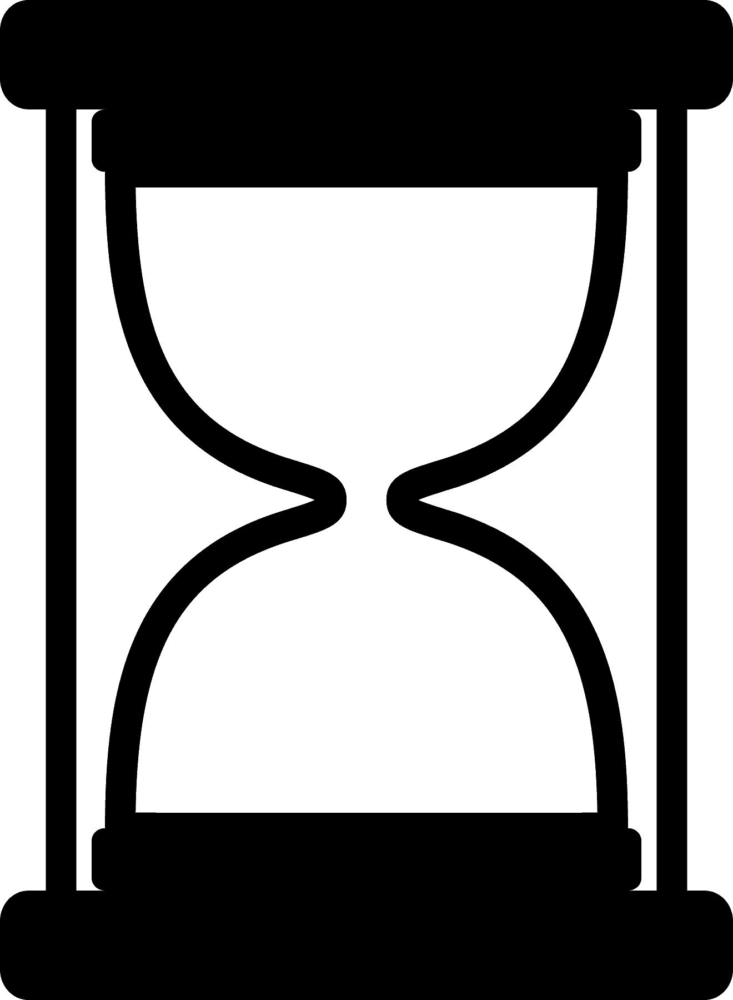
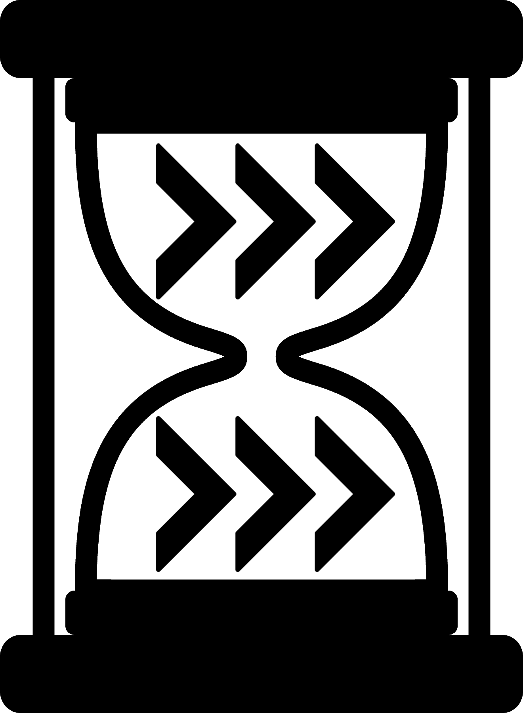

# Setup
Add 1 Boss monster to the battlefield.  
Add Elite Monsters equal to the number of players.  
Follow Boss+Elite monster setup instructions.  
Each player chooses a character and follows any setup instructions.

# Round

- Upkeep
- Monsters
- Characters – any order
- Cleanup

## Upkeep
(upkeep icon)
Check for upkeep effects.
1. Heros, Items, Abilities, Powers
2. Monsters

## Monsters
### Turn Order
1. Play a minion from the minion deck.
2. Activate monsters (sword) - minions first, then elites, then bosses. **During the first round activation, monsters deal no damage.**

## Heroes
Heroes take their turns in whatever order they choose. Heros may play simultaneously where possible.
### Actions

Each hero starts with two available actions. When you spend an action, flip it facedown.

Each hero may do any amount of swift actions per turn, but each swift action may only be used once per turn as a swift action. Any repeats of swift actions requires spending a normal action.

Temporary action. Used once, then removed. Removed at cleanup.

# Symbols and Keywords
**Swarm**  
(swarm)  
When a minion with swarm is played, play another one. The second minion played this way does not trigger swarm.

**Shields**  

Prevents damage with less than or equal to shield value, then is discarded. 

Prevents damage once each round. Add a use marker when used.

Prevents X damage of each instance of damage.

**Exhaust**  
Removed from your deck permanently.

**Destroyed**  
Goes to discard.

**Reclaim**  
Return cards from your discard to your hand.

## Cleanup
Remove use markers.
